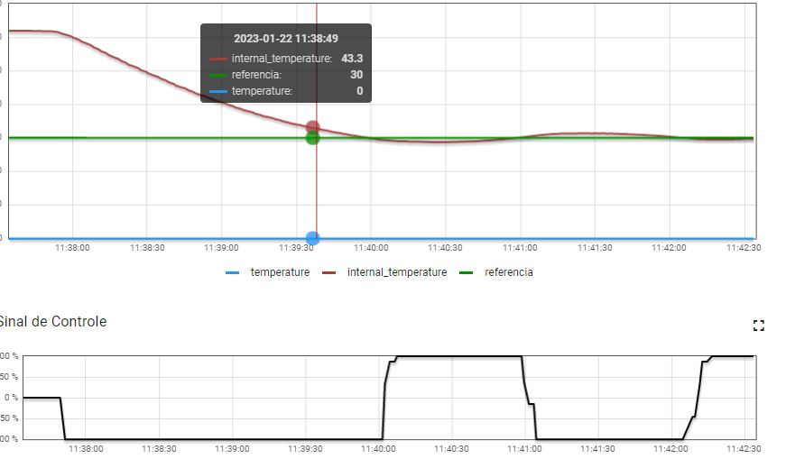
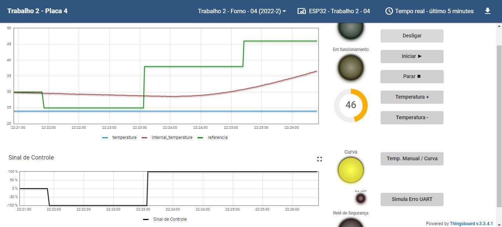

# Trabalho 2 FSE 2022.2
Trabalho 2 da disciplina de Fundamentos de Sistemas Embarcados (2022/2)

Autor: Vinícius Vieira de Souza - Matrícula: 17/0115500

## Descrição
A descrição sobre os objetivos e os detalhes de implementação requisitados podem ser encontrados através [deste link](https://gitlab.com/fse_fga/trabalhos-2022_2/trabalho-2-2022-2)

# Requisitos
- Python 3.9.2 e as seguintes dependências:
  - smbus2
  - RPi.bme280

## Uso
### Passo 1:
Certifique-se de que possui todas as dependências do python necessárias. Para instala-las basta utilizar o comando abaixo na raiz do projeto:
```sh
pip3 install -r requirements.txt
```
### Passo 2:
Coloque o programa para rodar com o comando na raiz do projeto:
```
python main.py
```
### Passo 3:
Em seguida acesse o Dashboard da placa raspberry utilizada para interagir com o forno.

## Screenshots
### Gráfico com o uso de uma referência fixa de temperatura (30 graus)




### Grafico demonstrando alteração da temperatura interna com o uso da curva de Reflow




## Video de apresentação:
<a href="https://youtu.be/vFwdDArBs58" title="Apresentação FSE">Video de apresentação</a>

OBS: O vídeo apresentado não demonstra o funcionamento do sensor de temperatura ambiente pois como é comentado, foi realizado na rasp 42 onde o sensor bme se encontra ausente. No entanto para o código deste repositório funcionar o ideal é executá-lo em uma placa com o sensor em questão.